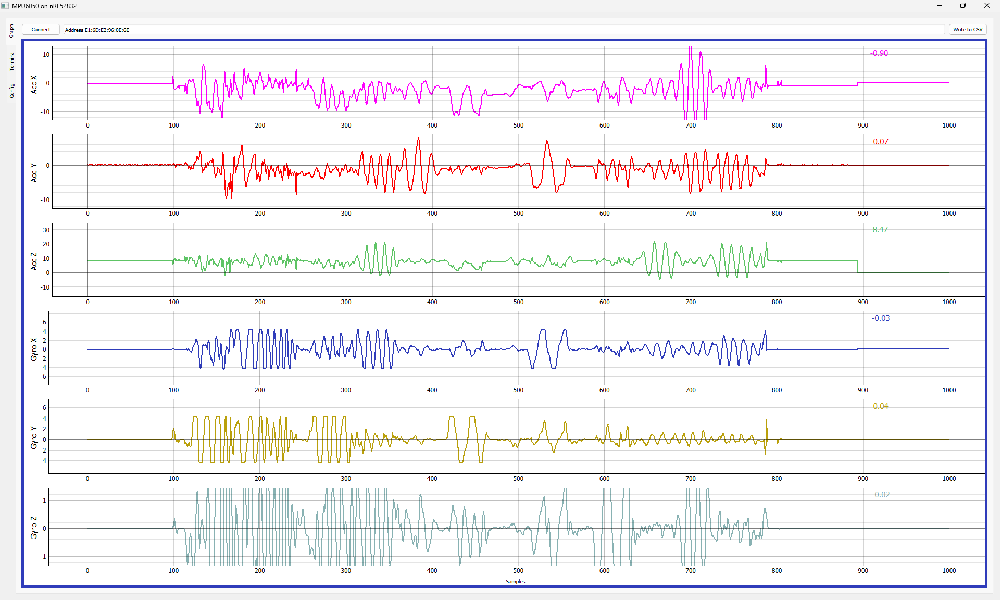

# SerialDataPlotter
Plots data incoming via COM or Bloototh Low Energy (Nordic BLEUART).
Tested only with Windows 11 and a very limited number of devices.

## HowTo:
Run **"SerialDataPlotter.py"**, grab the config from "config" tab and adjust it to your needs. Start with that config file as "--config" parameter.
UI is still pretty basic. To use BLEUART, put "Address *device address*" in "com" parameter of the config, or in edit field next to connect button.
 
## Helpers:
Use **CSVplotter.py** for having a look the CSV's content (*ToDo: add option to use same config as for recording in order to get same layout*). Use **MultipleSDPLauncher** for recording CSV files from different sources in a synchronized way.
The both "helper" tools were programmed together with Github Copilot, with just minor changes in the generated code.
 

